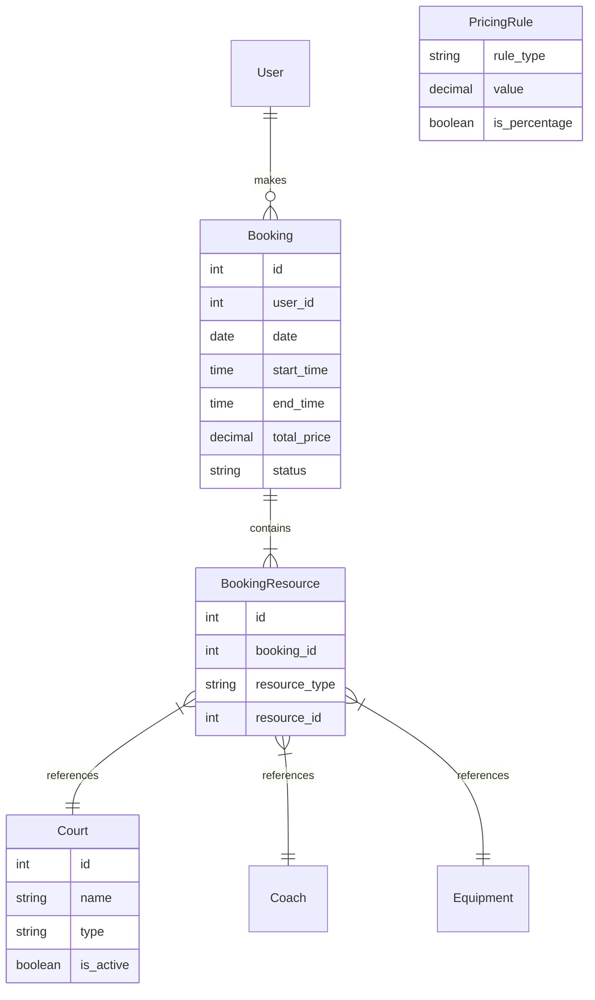

# Badminton Court Booking System - Project Technical Report

## 1. Project Overview
The **Badminton Court Booking System** is a full-stack web application designed to manage facility resources efficiently. It allows users to check availability, book courts, and rent equipment or hire coaches in a single transaction. The system is built with a **React (Vite)** frontend for a responsive user interface and a **Django REST Framework** backend for robust data management and security.

## 2. High Level Design (HLD)
The system follows a classic 3-tier architecture:
1.  **Presentation Layer**: A Single Page Application (SPA) built with React.js. It handles user interactions, state management, and communicates with the backend via RESTful APIs protected by JWT authentication.
2.  **Application Layer**: Django web server hosting the REST API. It handles business logic, authentication, pricing calculations, and transaction management.
3.  **Data Layer**: PostgreSQL database storing relational data with strict integrity constraints.

### System Architecture Diagram
```mermaid
graph TD
    User((User))
    
    subgraph Frontend [React SPA (Netlify)]
        UI[User Interface]
        API_Client[Axios Client]
    end

    subgraph Backend [Django Server (Render)]
        API[REST API Layer]
        Auth[Auth Service]
        Booking[Booking Service]
        Pricing[Pricing Engine]
        Resource[Resource Manager]
    end

    subgraph Database [PostgreSQL]
        DB[(Data Store)]
    end

    User <-->|HTTPS| UI
    UI -->|State Updates| API_Client
    API_Client <-->|JSON/JWT| API
    
    API --> Auth
    API --> Booking
    API --> Resource
    
    Booking -->|Calculate Cost| Pricing
    Booking -->|Lock Rows| DB
    Resource -->|Query| DB
    Auth -->|Validate| DB
```

**Data Flow**: `User Action -> React Client -> JSON Request -> Django View -> Service Layer -> Database Transaction -> Response`

## 3. Database Design & Tables
The database schema is designed for normalized relational data storage using **PostgreSQL**.

### Entity Relationship Diagram (ERD)


### Table Explanations
1.  **Users**: Stores authentication details. We use Django's default secure User model.
2.  **Bookings**: The central transaction table.
    *   `status`: Tracks if a booking is `CONFIRMED` or `CANCELLED`.
    *   `total_price`: Stores the final calculated cost at the time of booking (freezing the price).
3.  **Resources (Courts, Equipment, Coaches)**: Standalone logical tables representing inventory.
4.  **BookingResource (**Junction Table**)**: This is the core of our flexible design. Instead of having hardcoded columns like `court_id` or `coach_id` in the Booking table, we use this table to link a Booking to *many* different resources.
    *   *Example*: Booking #101 can have 3 rows in this table: one linking to Court A, one to Coach Bob, and one to a Racket.
5.  **PricingRules**: Configurable logical rules (e.g., "Peak Hour", "Weekend") that are applied dynamically by the Pricing Engine.

## 4. Atomicity & Concurrency (Critical)
To prevent "double bookings" (two users booking the same slot simultaneously), the system utilizes database-level locking:
*   **Atomic Transactions**: The `BookingService.create_booking` method is wrapped in `@transaction.atomic`.
*   **Row Locking**: We use `select_for_update()` when querying for court availability during the booking process. This locks the relevant database rows until the transaction completes.
*   **Result**: If two requests arrive at the exact same millisecond, the Database will force them to execute sequentially, guaranteeing data integrity.

## 5. Pricing Engine Approach
A hardcoded price list is inflexible. Instead, we implemented a **Dynamic Rules Engine**:
*   **Base Prices**: Defined per resource type (e.g., Court = $400/hr).
*   **Pricing Rules**: Additive modifiers applied based on conditions.
    *   *Example*: `Peak Hour Rule` (+10%), `Weekend Rule` (+15%).
*   **Calculation**: `Final Price = Base Price + Σ (Matching Rules)`. This allows admins to change pricing strategies (like adding a "Holiday Surcharge") without changing a single line of code.

## 6. Admin Panel Capabilities
 The system leverages the powerful Django Admin interface, customized for operational needs:
*   **Dashboard**: View all bookings, filter by status (Confirmed/Cancelled) or Date.
*   **Resource Management**: Add/Remove courts or change equipment stock instantly.
*   **Pricing Control**: Create or edit pricing rules on the fly.
*   **Bulk Actions**: Cancel multiple bookings or update statuses in bulk.

## 7. Seed Data Strategy
To ensure easy deployment and testing, a custom management command `seed_db` was created. It automatically populates the database with:
*   **Courts**: 4 Courts (2 Indoor, 2 Outdoor)
*   **Staff**: 3 Coaches
*   **Inventory**: Rackets, Shuttlecocks, Shoes
*   **Rules**: Default pricing logic (Peak/Weekend/Indoor rates)
*   **Users**: A test user and a superuser (`admin`).

This allows the entire system to be spun up from scratch on any new server with a single command: `python manage.py seed_db`.
